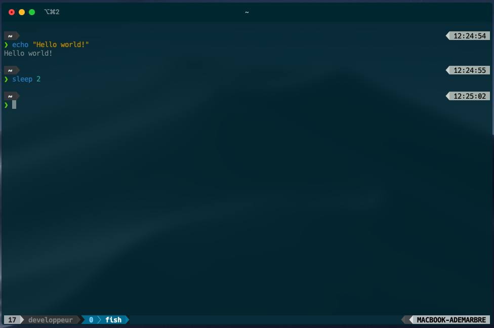

# iTerm2 Dotfiles

    

## Contents

- [Tmux config](/tmux/README.md)
- [Fish config](/fish/README.md)
- [Nano config](/nano/README.md)

## Shell setup (for macOS)

- [iTerm2](https://iterm2.com/)
- [Tmux](https://github.com/tmux/tmux/wiki)
- [Fish shell](https://fishshell.com/)
- [Fisher](https://github.com/jorgebucaran/fisher)
  - [z](https://github.com/jethrokuan/z)
  - [Fish NVM](https://github.com/jorgebucaran/nvm.fish)
  - [Tide](https://github.com/IlanCosman/tide)
- [Nerd fonts](https://github.com/ryanoasis/nerd-fonts) (I use Hack)
